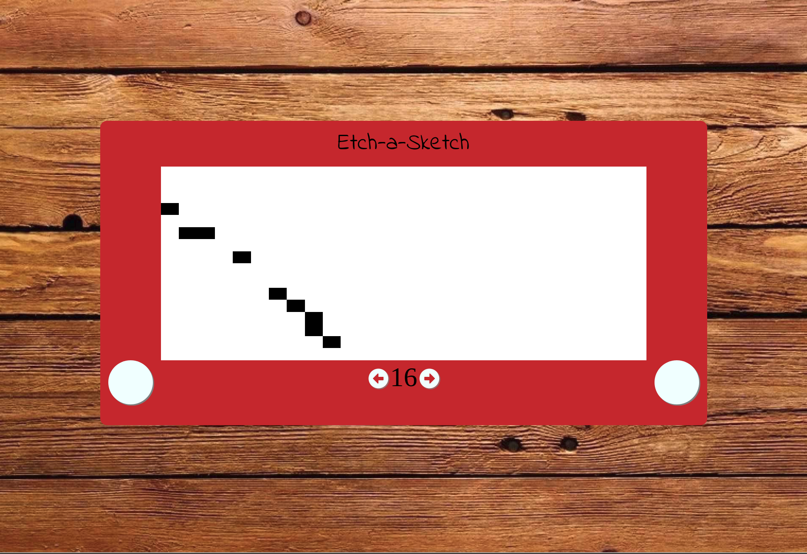

# Etch-a-Sketch Project

This project builds an etch-a-sketch that can be painted using your mouse and cleared/resized by pressing buttons.

This is a project from [The Odin Project](https://www.theodinproject.com/courses/web-development-101/lessons/etch-a-sketch-project).

## Pre-Project Thoughts

I am doing this project after having gone significantly forward in the curriculum.

They recently added the JS101 section with a revamped version of this project.

I plan on using CSS Grid for the first time this time.
The last time I did this project can be found [here](https://github.com/JonathanYiv/sketchpad).

This time I have a much stronger understanding of JavaScript and programming in general.

## Post-Project Thoughts

Wow.
The first time I did this, I used jQuery and wasn't familiar with Javascript at all.

I definitely see the value in learning the language before the framework.

JavaScript is very powerful for doing stuff to the DOM.

My code isn't very DRY this time around, but I'm barreling through.

I wanted to hammer the concepts and methods in more than anything.
